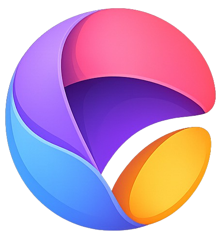

<div align="center">
  

  # OpenCanvas 3D

  **A free, open-source 2D/3D art app for Linux — inspired by Microsoft Paint 3D.**

  [](LICENSE)
  [](https://godotengine.org)
  [-informational.svg)](#run)
</div>

---

OpenCanvas 3D offers a simple, beginner-friendly way to create artwork and 3D
scenes, built in Godot 4 with C#. At its core it paints directly onto a real
3D model's surface: it raycasts against the mesh, interpolates UV
coordinates, and draws into a live texture used as the model's material.
Every paintable mesh — the model and each shape you place — gets its own
independent canvas, so painting one never bleeds onto another.

## Contents

- [Features](#features)
- [Run](#run)
- [Controls](#controls)
- [License](#license)

## Features

| | |
|---|---|
| 🖌️ **Painting** | Brush, eraser, fill (bucket), and eyedropper, with brush type, thickness, opacity, and a color palette |
| 🔠 **Text & shapes** | Stamp text, draw 2D shapes on the canvas, or drop 3D primitives (cube, sphere, cone, cylinder, capsule, torus) — each shape paintable on its own |
| 🌀 **3D Doodle** | Freehand strokes in the scene are extruded into real 3D tube meshes, not flat lines |
| 🖼️ **Model import** | Drag and drop or import your own `.glb`, `.gltf`, or `.obj` model to paint on |
| ↩️ **Undo/redo** | Full undo/redo history per canvas (`Ctrl+Z` / `Ctrl+Y`) |
| 🔁 **2D/3D view** | Toggle between the live 3D scene and a flat 2D view of the canvas |
| 🎥 **Camera** | Right-drag orbit, scroll-wheel zoom |
| 📤 **Export** | Save the painted texture out to PNG |

## Run

Open the project in **Godot 4.6+** with C# support, or build the scripts
directly:

```sh
dotnet build
```

Main scene:

```text
res://scenes/Main.tscn
```

## Controls

| Action | Control |
|---|---|
| Paint / fill / pick color / place a shape or doodle | Left-click and drag on the model |
| Orbit camera | Right-click and drag |
| Zoom | Mouse wheel |
| Undo / Redo | `Ctrl+Z` / `Ctrl+Y` |

**Ribbon:** brush · eraser · fill · eyedropper · doodle · text · 2D shapes ·
3D shapes · clear · export · import model

**Side panel:** brush/shape type · thickness · opacity · color

## License

OpenCanvas 3D is licensed under the [GNU GPL v3](LICENSE).
